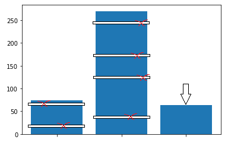
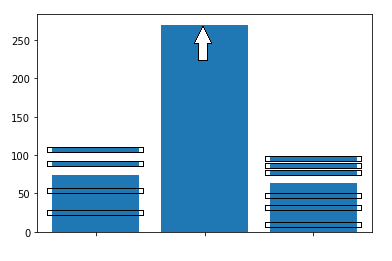

## Random Sampling
Алгоритм перебалансировки наблюдений по классам

### Under sampling 

Перебалансировка удалением случайного наблюдения из больших классов до числа наблюдений соответствующих минимальному классу

### Over sampling

Перебалансировка добавлением случайного наблюдения малым классам до числа наблюдений соответствующих максимальному классу (своеобразный Bootstrap).
    

### Результат

Используя самопальный алгоритм KNN со скользящим контролем оценим изменение метрики в зависимости от типа перебалансировки.

- Начальный размер классов: [ 83 126 168]\
Доля верных ответов: 0.639

- Перебалансировка классов до минимального\
Размер классов: [81 81 81]\
Доля верных ответов: 0.624

- Перебалансировка классов до максимального\
Размер классов: [168 168 168]\
Доля верных ответов: 0.747